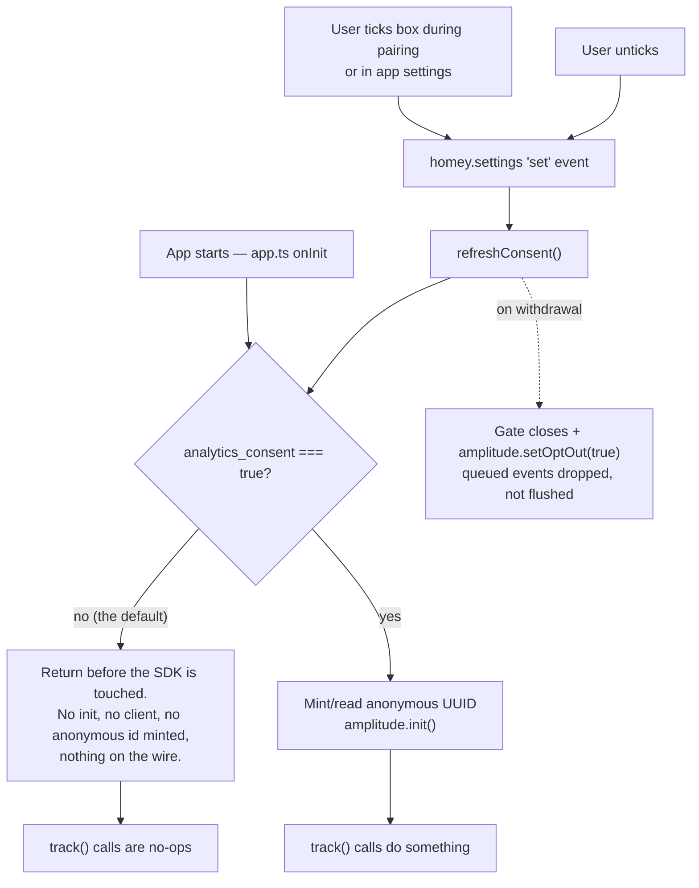

# What the app measures, and what it deliberately doesn't

**This file is the source of truth for what this app sends and why.** Update it *before every release*
that adds, removes or changes an event, a property, or the consent flow — not on every build. If you add
a `track()` call without adding a row here, the next person cannot answer "what does this app send?"
without reading the whole codebase, which is the exact question this file exists to close.

> **For names and types, [`analytics-taxonomy.md`](analytics-taxonomy.md) is the source of truth.**
> That file is the cross-app contract — it is byte-identical in `com.nibe.local` and
> `com.homevolt.local`, which both report into one Amplitude project, so a property name means the
> same thing and has the same type in both or the shared project is worse than two separate ones.
> **Check it before adding or renaming any event or property, and never edit it in one repo alone.**
> This file keeps the privacy prose, the consent flow, and the call sites; it does not get to invent
> a name.

Last verified against the code: **1.1.1**.

## Why there is any of this

This app is a fork maintained by one person against **one** physical pump, an S1155. The register map,
which registers exist, which alarms fire and whether detection works at all all differ per model. None
of that can be learned from a forum thread, because the people whose setup works never post.

So the questions the telemetry exists to answer are narrow and specific:

1. **Which models are out there?** (`pump_model_code`)
2. **Which of the six function devices do people actually create?** (`roles`)
3. **Which feature groups within each function?** (`features_<role>`)
4. **Where does setup fail on hardware the maintainer cannot test?** (`Completed Detection`, `Clicked Button`)

Everything else in the event list earns its place by serving one of those four. This is not engagement
analytics, and it should not grow into it.

## Consent — the part that matters

Nothing is collected without an explicit opt-in. There is no "legitimate interest" reading of this,
no soft default, and no dark pattern.

- **Opt-in, unticked by default.** The checkbox is on the pairing device picker
  ([`drivers/nibe_s/pair/devices.html`](../drivers/nibe_s/pair/devices.html)), directly above the Add
  button, so it is the last thing read before committing rather than a banner to click past.
- **Revocable without deleting or repairing anything.** App settings → **Privacy**
  ([`settings/index.html`](../settings/index.html)). Reached via More → Apps → Nibe Live → Configure.
  A consent switch nobody can find is not a consent switch, which is why it has its own heading.
- **Withdrawal is immediate**, not next-boot. `app.ts` listens on `homey.settings.on('set')`, so the
  gate closes and the SDK is opted out on the next event. Both UIs write the same `analytics_consent`
  setting, so either reflects the other.
- **Granting is also immediate** — ticking during pairing enables tracking in time to record that same
  pairing run. That is why one pairing run is enough to verify the pipeline.

### Where the data goes

**The EU.** `lib/analytics.ts` sets `serverZone: 'EU'`, so events go to
`https://api.eu.amplitude.com/2/httpapi` and are stored in Amplitude's EU instance
(`analytics.eu.amplitude.com`). No transfer to a third country.

This is stated explicitly in the code because **the SDK default is `US`**
(`https://api2.amplitude.com/2/httpapi`). Leaving it unset does two bad things at once: it ships EU
users' data to the US, *and* it silently breaks ingestion, because an Amplitude ingestion key is
scoped to its project's region and the US endpoint rejects an EU key. Do not remove the option
thinking it is redundant.

### One project, several apps

The ingestion key is **shared with `com.homevolt.local`** and with any future Homey app: one
Amplitude project serves all of them, and an **`app` property on every event** (plus a matching user
property) separates them again. That is the whole reason `app` exists.

It is read from `manifest.id`, never hardcoded, so no app names itself and a third one gets the
separation for free. In `track()` it is merged **after** the caller's properties, so a call site can
never shadow it — `app` has to be authoritative, because every cross-app chart filters on it and one
mislabelled event is one attributed to the wrong product.

**Do not mint a per-app key.** Amplitude charts cannot span projects, so splitting the key would
permanently foreclose every cross-app question — and you would not find that out until the first
time you wanted to ask one.

One consequence worth knowing: `analytics_device_id` lives in each app's own Homey settings, so a
Homey running both apps is **two** anonymous profiles, not one. Per-app counts are exact; "how many
people run both" is not answerable, by construction.

### The only identifier

A random `crypto.randomUUID()`, stored as `analytics_device_id`, minted on first use *after* consent.
Not the pump IP, not a serial, not a model, not anything derived from the home. It exists solely because
Amplitude requires a `device_id` or `user_id` per event.

## What is never sent

This list is as load-bearing as the event table. Adding anything here is a decision, not a detail.

| Not sent | Why |
| --- | --- |
| **Register readings** | Temperatures, degree-minutes and power draw are a timestamped record of when the compressor ran and when someone showered — occupancy inference. `Fired WHEN Card` carries the card and register name and stops there. |
| **IP addresses, subnet, discovery results** | Network shape is not a product question. |
| **Pump serial** | Identifying. `pump_model_code` answers the model question without it. |
| **Alarm descriptions** | Only the numeric `code` — it is the model's own identifier and is language-independent. |
| **Device names, zone names, Flow names** | User-authored, frequently personal. |
| **A model *name*** | `pump_model_code` is the raw register 1497 value, deliberately unmapped: the code→name mapping varies by model and firmware, and guessing would poison the data this exists to produce. Map it in Amplitude, where a wrong guess is reversible. |

> **Caveat on IP — the one thing this app does not fully control.** Nothing in the code sends an IP
> address, but the events are posted *from the hub*, so Amplitude sees the household's public IP as
> the request origin and may derive coarse geolocation from it (`location_lat`, `location_lng`,
> `country` appear in the project taxonomy by default). That is Amplitude's behaviour, not this
> app's, and it is why `timezone` is sent explicitly — an IP-derived country is a side effect,
> whereas timezone is a stated, auditable choice. If IP-derived geo is unwanted, the Node SDK
> accepts an `ip` override per event and it can be suppressed at the `track()` choke point.

## The events

Ten names with rich properties, rather than one event name per Flow card. There are 37 action cards
alone; a name each would produce a taxonomy nobody can use.

The three Flow events are named after **Homey's own WHEN / AND / THEN wording**, not Amplitude's
trigger/condition/action vocabulary — a Homey user reading a chart should recognise the row of the
Flow it refers to. (They were briefly called `Fired Flow Trigger`, `Evaluated Flow Condition` and
`Ran Flow Action`; those names are retired in Amplitude and carry only pre-rename test data.)

| Event | Fires when | Properties | Call site |
| --- | --- | --- | --- |
| `Started App` | App boots | `app_version` | [`app.ts:17`](../app.ts) |
| `Clicked Button` | Any manual click in a **pairing or repair** view | `view`, `button` | [`lib/driver.ts:240`](../lib/driver.ts) via `track_ui` |
| `Changed Capability` | A slider/toggle moved from outside the app — tile, mobile app, web API — **after** the write succeeds | `capability`, `role` | [`lib/device.ts:581`](../lib/device.ts), mirror at `:605` |
| `Ran THEN Card` | Any of the 34 per-register cards or the 3 generic ones runs | `card`, `register`, `role`, `ok` | [`lib/driver.ts:116`](../lib/driver.ts) |
| `Checked AND Card` | Any of the 5 condition cards is evaluated | `card`, `register`, `role`, `ok`, `result`¹ | same wrapper |
| `Fired WHEN Card` | A trigger actually fires | `card`, `register`, `role` — **never the value** | [`lib/device.ts:231`](../lib/device.ts), priority at `:646` |
| `Raised Alarm` | A new alarm appears (not one already standing at startup) | `code` | [`lib/device.ts:729`](../lib/device.ts) |
| `Completed Detection` | A detection pass finishes **or fails**, in pairing or repair | `mode`, `found_nothing`, `registers_total`; `registers_responded`, `groups_recommended`² | [`lib/driver.ts:249`](../lib/driver.ts), failure path at `:276` |
| `Changed Device Set` | A device is added, removed, or reconfigured via Repair | `action`, `role`; `groups_enabled`³ | [`lib/device.ts:1102`](../lib/device.ts), `:1108`, [`lib/driver.ts:1008`](../lib/driver.ts) |
| `Lost Connection` | The socket drops unexpectedly | `cause` (`watchdog` / `socket_close`); `dead_polls`⁴ | [`lib/connection.ts:542`](../lib/connection.ts) |

¹ `result` is present **only on success**. When the run listener throws, the event carries `ok: false`
and no `result` — nothing was evaluated, so there is no boolean to report. Do not build a chart that
assumes every `Checked AND Card` has a `result`.
² Only on the **success** path. A detection that threw carries no samples and no recommendations, so
both are omitted rather than sent as zero — see the note below.
³ Only with `action: 'reconfigured'`. The `added` and `removed` events come from the device's own
`onAdded`/`onDeleted` and carry `action` and `role` only.
⁴ Only with `cause: 'watchdog'`. A `socket_close` has no poll count to report.

### Property glossary

These descriptions are also set on the properties in Amplitude itself, so the UI explains itself.
**Keep the two in sync** — if you change one, change the other.

| Property | Meaning |
| --- | --- |
| `app` | **Which Homey app sent this** — `com.nibe.local`, `com.homevolt.local`, … Present on *every* event, merged in at the `track()` choke point from `manifest.id`. One Amplitude project serves several apps; this is what separates them. Filter on it in any chart that is about one product. |
| `role` | **Which pump function this happened on** — `main`, `heating`, `hotwater`, `pool`, `cooling`, `solar`. The headline dimension: it is what makes "was this run on Heating or on Hot water?" answerable. `unknown` means the device could not be read and is a bug, not a real function. |
| `card` | The Homey Flow card id — generic (`set_numeric_value`) or per-register (`target_temperature.h59_hotwater_start.set`). |
| `register` | The Modbus register acted on, named as its capability. The `i`/`h` prefix is the address type: `i` = input (read-only sensor), `h` = holding (writable setting). |
| `ok` | Whether the card's run succeeded. `false` = it threw, usually because the model lacks that register or the value was out of range. A card with a high false rate is a model-compatibility bug. |
| `result` | What an AND card evaluated to — i.e. whether the Flow carried on past that row. Absent when `ok: false`: a listener that threw evaluated nothing. |
| `view` / `button` | Which web view, and which button in it. |
| `capability` | The capability changed by hand. |
| `code` | The Nibe alarm code, numeric and language-independent. |
| `mode` | `pair` (first setup) or `repair` (changing an existing device). |
| `registers_responded` / `registers_total` | Detection coverage on this pump. `registers_total` is a static profile fact and is always sent; `registers_responded` needs samples, so it is absent on a failed pass. |
| `groups_recommended` / `found_nothing` | What detection recommended; `found_nothing` names the outright failure. `groups_recommended` is absent on a failed pass. |
| `action` / `groups_enabled` | `added`/`removed`/`reconfigured`; `groups_enabled` (the groups left switched on) accompanies `reconfigured` only. |
| `cause` / `dead_polls` | `watchdog` (socket open, pump silent) vs `socket_close` (connection dropped); `dead_polls` (how many empty polls preceded it) accompanies `watchdog` only. |

### Notes on individual events

**`Started App`** carries `app_version` and nothing else. It used to also send
`prompt_version: 'BA400.4'`, a marker from the Amplitude setup wizard that scaffolded this
integration; it had no product meaning and has been removed. Do not reintroduce it.

**`Clicked Button`** is one event for every button, distinguished by `view`/`button`, so
"how often is detection skipped?" is a filter rather than a separate event name. It covers the
**pairing and repair views only** — the app-settings page ([`settings/index.html`](../settings/index.html))
emits nothing at all. It has exactly one control, the consent switch, and that writes the
`analytics_consent` setting directly; tracking a click on the switch that governs tracking is the one
click this app must not record. Current pairs:

| `view` | `button` |
| --- | --- |
| `detect_pair`, `detect_repair` | `retry`, `skip` |
| `pair_devices` | `add` |
| `repair_features` | `save`, `expand_group` |

The views run inside Homey's app, not in the app process, so they can never reach the SDK. They report
via `Homey.emit('track_ui', …)` to a handler in the driver
([`assets/pair/detect.js:64`](../assets/pair/detect.js), [`devices.js:256`](../assets/pair/devices.js),
[`features.js:202`](../assets/pair/features.js) and `:233`).

**`Ran THEN Card` / `Checked AND Card`** come from a single `tracked()` wrapper applied at the
six `registerRunListener` sites in [`lib/driver.ts`](../lib/driver.ts), **not** card by card — so a card
added later is instrumented by construction rather than by remembering. A failed run is tracked with
`ok: false` and the error is rethrown untouched: an action failing because the model lacks that register
is precisely the signal worth having.

**`Fired WHEN Card`** is bounded by how `checkTrigger` works: it fires only for **bool and enum**
registers (18 + 7 = 25 of the table's 120). The other 95 — the continuous analog values polled every
10 s, temperatures and degree-minutes and watts — emit nothing at all. This is why "track every Flow
call" is a few hundred events a day rather than the ~250k/day a naive reading of the poll loop would
suggest. **If `checkTrigger` ever starts firing for analog registers, this event becomes a firehose** —
check here first.

Trigger *cards* also have run listeners, but Homey calls those as a filter for every Flow subscribed to
the card. Tracking there would count subscriptions, not fires, which is why the wrapper skips
`kind: 'trigger'` and the instrumentation lives at the fire site instead.

**`Completed Detection`** is the highest-value row in the table — it is the only thing that reports
whether detection works on hardware the maintainer does not own. `found_nothing` is named explicitly
rather than left to be inferred from a zero.

It fires from **two** paths, and the difference matters when reading a chart:

| Path | `found_nothing` | `registers_responded` / `groups_recommended` |
| --- | --- | --- |
| The pass returned a result | `true` only if nothing was recommended | present |
| The pass **threw** | always `true` | **absent** |

The failure path exists because it was previously missing: a detection that threw sent nothing, so the
hardest failure there is — the probe never completing on a model the maintainer cannot test — was
indistinguishable in Amplitude from a detection the user never started. The two omitted properties are
absent rather than zero on purpose: a rejected promise carries no samples, and a `registers_responded: 0`
would collide with a real and different measurement (a pass that *completed* and got no answers). Split
the two paths in a chart by whether `registers_responded` is set. The error message is never sent — it is
unbounded free text.

## User properties

The install as a *shape*, not a stream. Sent with `Identify` from
[`lib/analytics.ts:183`](../lib/analytics.ts), debounced 5 s so six devices finishing `onInit` together
produce one identify rather than six.

| Property | Example | Answers |
| --- | --- | --- |
| `app` | `"com.nibe.local"` | Which Homey app this profile belongs to — the shared project's separator |
| `pump_model_code` | `"1155"` | Which models are in the wild |
| `firmware` | `"9385"` | Which firmware, for register-map differences |
| `roles` | `["cooling","heating","hotwater","main"]` | Which functions people use |
| `role_count` | `4` | Convenience for segmenting (Amplitude cannot group by array length) |
| `features_<role>` | `features_heating: ["heating","ventilation","energy"]` | Which features within each function |
| `app_version` | `"1.0.1"` | Version segmentation |
| `homey_version` | `"12.4.1"` | Which Homey software versions are in the field |
| `homey_platform` | `"local"` / `"cloud"` | Homey Pro vs Homey Cloud (i.e. behind a Bridge) |
| `homey_platform_version` | `2` | With `homey_platform`, identifies the hub generation |
| `timezone` | `"Europe/Stockholm"` | The country signal |
| `language` | `"sv"` | Which of the six shipped languages are actually used |
| `units` | `"metric"` | Whether an imperial user would ever hit unit bugs |

**`roles` is the same vocabulary as the per-event `role`, at install scope.** `role` says which part of
the installation an event happened on; `roles` says which parts the install *has*, and `role_count` is
its length because Amplitude cannot group by array length. Neither derives from the other — an install
that paired a Cooling device and never triggered a Flow on it emits no `role: 'cooling'` event, and
absence of events is not absence of hardware. These were called `functions` and `function_count` until
two unrelated words for one concept caused real confusion; the cross-app taxonomy settled on `role`.

> **The old names are orphaned, not gone.** Amplitude's `Identify` only ever `.set()`s — there is no
> unset — so every profile that reported before the rename keeps its last `functions` and
> `function_count` values forever. In the UI they are permanently stale properties. Prefer `roles`;
> treat the old pair as pre-rename data only, and expect the same trap on any future user-property
> rename.

`homey_platform` + `homey_platform_version` are reported **raw, not mapped to a product name**.
`local` + `2` is a Homey Pro (Early 2023) and `cloud` means Homey Cloud behind a Bridge, but that
mapping is Athom's to change and would rot here — same reasoning as `pump_model_code`. Both are
documented as `undefined` on older Homey software; the SDK says to assume `local` and `1`, and
[`hostFacts()`](../lib/driver.ts) uses exactly those documented defaults rather than guessing.

**Country comes from `timezone`, deliberately.** Every zone that matters resolves to one country, and
it avoids embedding an IANA→ISO table that goes stale. `language` and `units` are locale, not
location — plenty of Swedish users run Homey in English, so do not read country off them.

These are user properties rather than event properties on purpose. The questions are cross-sectional —
*"of the S1255 installs, how many run cooling?"* — and that is a segmentation, not an event count. As
event properties they would only describe whichever event happened to carry them.

Re-sent whenever the shape may have changed: a device added or deleted, a Repair applied, or
`updatePumpInfo()` finally getting an answer from the pump (which is when the model code first becomes
known — at `onInit` there is no model yet).

## Where the code lives

All of it is in [`lib/analytics.ts`](../lib/analytics.ts) — one file to read when asking what the app
sends, and one file to delete if the answer should become "nothing". Everything else is a single
`track(...)` line at a call site.

`track()` is fire-and-forget by design: it is called from poll chains, Flow run listeners and capability
listeners, none of which should wait on a network round trip. Failures are logged rather than swallowed,
but can never reject into the caller.

**To remove analytics entirely:** delete `lib/analytics.ts`, drop `@amplitude/analytics-node` from
`package.json`, and remove the `track`/`initAnalytics`/`refreshConsent` imports and call sites listed in
the tables above. The consent UI in `devices.html` and `settings/index.html` and the six locale keys
(`pair.devices.analytics`, `pair.devices.analytics_desc`) go with it.

## Sharp edges

- **The SDK is `@amplitude/analytics-node`, not `@amplitude/unified`.** Unified is browser-only — every
  one of its dependencies is a `-browser` package needing `window`/`document`/`localStorage`. There is
  no autocapture and no Session Replay server-side; do not add them back by swapping the package.
- **The API key is hardcoded** in `lib/analytics.ts`. It is an ingestion key and public by design, but
  move it to an env var if this repo ever gains environment machinery. **The key and `SERVER_ZONE`
  move together** — a key from a US project will not authenticate against the EU endpoint.
- **Athom review will ask what the app sends and where.** Point them here, and keep the
  `README.md` privacy note in sync.
