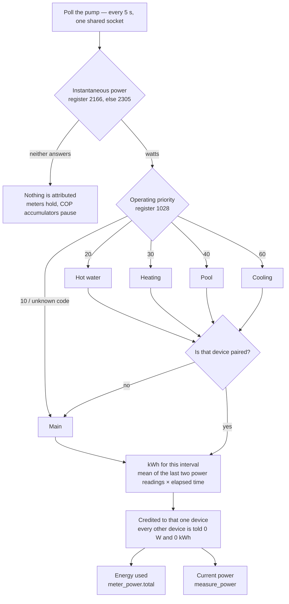
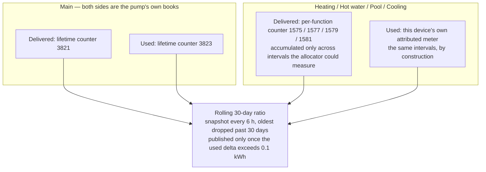

# How energy is attributed, and how COP is derived

**This file is the source of truth for the energy/COP business logic.** Update it *before every release*
that touches attribution, the power sources, the role mapping or the COP accumulators — not on every build.
The [README](../README.md) links here and carries the user-facing summary.

Last verified against the code: **0.9.12**.

## The problem

The pump reports **one** instantaneous power figure for the whole unit, and separately **what it is currently
busy with**. It does not report per-function consumption in real time. But the app pairs one Homey device per
function, and each of those has to carry its own consumption meter to show up in Homey's Energy tab.

So per-function *used* energy is **attributed**, while per-function *delivered* energy is **measured** — the
pump keeps real counters for heat out, just not for electricity in.

## Attribution — one watt belongs to exactly one device

The load-bearing property is the **winner-takes-all** step. Nothing is split proportionally and nothing is
estimated, so the sum across the paired devices is the pump's own total *by construction*. Consequences:

- **Main is the remainder, not the total.** Main is charged when priority reads 10 (idle/standby), when the
  code is one we don't recognise, and when the function that *is* running has no paired device. It is not
  "the whole pump" — the whole pump is the sum of all five.
- **An unpaired function quietly folds into Main.** The app logs a warning the first time this happens per
  app start, so it doesn't go unnoticed, but the energy still lands on Main.
- **If neither power register answers, nobody is charged.** The meters stand still rather than guessing. On
  split models (S320/S325, S330/S332, S2125) register 2166 does not exist, which is why 2305 is the fallback;
  before 0.9.9 those models silently showed no energy data at all.
- **Interval length doesn't matter.** The trapezoid uses the actual elapsed time, so a slow poll or a
  reconnect gap integrates correctly rather than dropping energy.

## COP — two different derivations

**Main's COP is authoritative.** Both inputs are pump counters that advance together, so it will reconcile
with myUplink over the same window.

**A function COP inherits whatever error the attribution has** — currently under 1%, see below.

### Why the accumulator gate exists

An S2125 owner reported hot water at **COP 14.96** and cooling at **10.17** while Main read a correct ~3.0.
The cause was a baseline asymmetry, not a bad reading: the per-function *delivered* counter runs whenever the
pump runs, but the *used* meter only advances while the allocator can measure. A numerator covering months
was being divided by a denominator covering hours — 40 ÷ 2.64 = 15.15, essentially the reported figure.

The fix (0.9.12) was to gate the numerator on the same condition as the denominator: `copProducedAccum` only
takes a step while `allocationLive` is true and a previous reading exists, so both halves span identical
intervals. A negative step (counter reset) is ignored rather than propagated. The accumulator is persisted in
0.01 kWh increments, so an ungraceful restart loses an amount that cannot move the ratio.

Main needs none of this — its two inputs are already aligned with each other.

### Why COP can be blank

Three separate reasons, all deliberate:

- the 30-day window needs a snapshot to compare against, so it is blank on a fresh pair and after the upgrade
  that discarded the poisoned pre-0.9.12 samples;
- the value is withheld until more than **0.1 kWh** has been used in the window, because a 0.02 kWh sliver
  divides into nonsense;
- a function that never runs (a pool you don't have) never crosses that threshold, and showing nothing is
  more honest than showing zero.

## Measured vs attributed, per figure

| Figure | Where it comes from | Trust |
|---|---|---|
| Current power, per function | attributed from total power + priority | estimate |
| Energy used, per function | integrated + attributed | estimate, measured under 1% off |
| Energy used, Main | the remainder — idle, unknown codes, unpaired functions | estimate |
| Energy delivered, per function | pump counters 1575/1577/1579/1581 | the pump's own figure |
| Total produced / consumed, Main | pump counters 3821/3823 | the pump's own figure |
| Total COP, Main | 3821 ÷ 3823 | both sides the pump's own |
| Per-function COP | pump counter ÷ attributed meter | one side attributed |

## How accurate the attribution actually is

Measured on the maintainer's S1155, and independently corroborated on an S735.

| Method | Result |
|---|---|
| Direct, instrumented — a 2.35 kWh boost-forced hot-water cycle against the pump's own hourly books (2026-08-02) | **−0.8%** |
| Shadow monitor over a full day | −5.3% |
| Reconstruction from the hourly energy log | −6.5% |
| S735, 1.24 kWh boost-forced cycle, cross-checked against MyUplink (halderex, 2026-08-01) | matched, COP 2.86 |

An earlier **+37%** figure was an artefact and has been retracted: it compared against register 3823, which
lags the pump's hourly log by about an hour and quantises to 0.1 kWh steps. The result was impossible on its
face — one function claiming more than the whole pump used — and a debt-based corrector built on it was
backed out. Three independent measurements agree the real error is small and *negative*.

At each `:00` the app still reads the pump's own per-function hourly figures and logs an attribution check
against what the allocator credited. **It compares only — it never corrects the meter.** That is what
produced the −0.8% figure, and it stays measurement-only until there is a reason to act on it.

## Known warts

- **`meter_power.total` is titled "Total energy consumed" on every device**, including Main, where it holds
  only the remainder. Homey applies `capabilitiesOptions` per capability id, not per role, so all five
  devices share one title. Renaming it means a new capability id — an Insights log's display name is
  snapshotted the first time the id is ever added and can never be changed afterwards.
- **The pump knows its current-hour energy and won't tell us.** Menu 3.1 shows a filling bar, but no Modbus
  register publishes it. Checked three ways: every "hour" title across all six model register maps, Nibe's
  published symbol list, and the myUplink Homey device. The hourly log registers hold the *previous completed
  hour* and step at `:00`.

## Related notes

- [`tasks/todo.md`](../tasks/todo.md) — the working plan and the resolved verdict on correction.
- [`tasks/todo-halderex.md`](../tasks/todo-halderex.md) — external S735 verification.
- [`tasks/s735-energylog-verification.md`](../tasks/s735-energylog-verification.md) — the full write-up.
