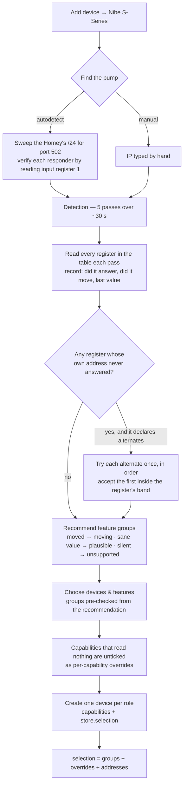

# Pairing, detection and register resolution

**Source of truth for what happens between "Add device" and a working device.** Update before a release that
changes detection, the pairing views or how a selection is stored.

Last verified against the code: **0.9.15**.

## The flow

Detection is skippable. Skipping it means no recommendation and no resolution, which the selection machinery
reads as **everything enabled on its primary address** — the same state a device paired before any of this
existed is in.

## What detection decides

Three separate outputs, often confused:

| Output | Question it answers | Consumed by |
|---|---|---|
| `recommendations` | is this feature group worth showing? | which group checkboxes start ticked |
| `samples` | did this individual register carry data? | which capabilities inside a ticked group start ticked |
| `addresses` | where does this register actually live? | what the runtime puts on the wire |

The evidence grades are deliberately ordered: a register that **moved** during sampling is live beyond
argument; one that merely read a **plausible** value might be a coincidence; one that never answered is
**unsupported** on this model.

Plausibility is not "did it answer". Register 2727 answered 31 of 31 reads and was flat zero through a
3.3 kW run — answering proves the address exists, not that the value means anything.

## Register resolution

A register may declare `altAddresses` plus an `altPlausible` band. Detection tries them **only when the
register's own address produced nothing at all across the whole run**, and records the first alternate that
reads inside the band.

Two different situations need this, and only one is predictable from Nibe's register maps:

| | what happens on the wire | example |
|---|---|---|
| **(a) relocation** | the primary doesn't answer; the register lives elsewhere on that model | heating medium pump speed at **1636** instead of 1102 on the S330/S332 |
| **(b) present but dead** | the primary answers, always with the not-available sentinel | room temperature on the **S735**: 111 is documented and empty, 26 is undocumented and correct |

**Case (b) is why a model-code lookup table cannot replace this.** Only reading the pump finds it. It is also
why model identification stays *reporting* — the type code and firmware are shown in Main's settings and in
the logs — rather than branching.

Currently declared:

| register | primary | alternate | on |
|---|---|---|---|
| heating medium pump speed (GP1) | 1102 | 1636 | S330/S332 |
| night cooling 1 | 227 | 2955 | S2125, S330/S332 |
| pulse energy meter (BE6) | 398 | 396 | S320/S325 |

## Sources — when the pump cannot decide and the user must

`altAddresses` answers "where does this register live". It resolves silently because there is only ever one
right answer. **`sources` is the other case: several addresses all carry plausible values, and they are
different quantities.** No amount of probing settles which one the user means, so detection asks.

Indoor temperature is the example, and the reason this exists:

| address | what it actually is |
|---|---|
| **116** | Room average temp. clim. system 1 — the value that regulates, from whichever sensors the zone uses |
| 111 | Room average temp. clim. system **6** — a different climate system |
| 26 | Roomsensor 1-1 — one individual wired sensor, not a system average |

**Nibe's CSV calls 116 "(BT50)" and that is legacy wording, not a fact.** The maintainer's S1155 has no wired
room sensor at all — 26/25/24 all answer with a Modbus exception and "Use room sensor CS1" reads 0 — yet 116
reports a real, independently moving value, because it comes from the wireless room unit assigned to the zone.
So the app never says BT50 to the user.

In a one-zone house only 116 answers and there is nothing to ask. In a house with a wired sensor *and* zone
sensors, two or three of these are alive at once and genuinely differ. Until 0.9.13 the table declared 111 as
the primary on the mistaken reading that the CSVs put BT50 there — on the maintainer's own S1155 that returns
the sentinel, so the capability resolved to nothing at all.

How it behaves:

- **every** candidate is probed, whatever the register's own address did — the question isn't "did the primary
  fail" but "is there more than one true answer here";
- candidates passing `altPlausible` are kept in declared order, and the register's own address must be listed
  first because it is the default;
- **one live candidate is not a choice**, but it is still *stated* — the view prints "Using: climate system 1
  average — 23.5" rather than leaving a bare "Indoor temperature" that says nothing about where the number
  comes from. The address is recorded in `addresses` either way, which is what keeps the S735 working, where
  only 26 answers;
- **two or more** become a radio group under that capability, in both the pairing device picker
  (`assets/pair/devices.js`) and the repair features view (`assets/pair/features.js`). Each option shows what
  that address actually read, because "23.5" vs "18.1" is the only thing that distinguishes them to a human.

The pick lands in the same `Selection.addresses` map as a resolved alternate, so reads, writes and flow
autocompletes need no special handling. `cleanSelection()` accepts an address only if the register declares
`sources` and actually offers it — the view is untrusted input.

### Choosing a band

The band's job is to reject an undocumented address that answers with something which merely *decodes* as a
number. Pick bounds that make a dead reading implausible:

- room temperature uses **5..40**, not −10..50, so a disconnected sensor's flat 0 falls outside;
- a pulse meter uses **0..1 000 000**, because a meter that has counted nothing genuinely reads 0.

There is no universal "reject exactly 0" rule, because whether 0 is data depends entirely on the register.

### Where the answer is kept

In the device's stored `selection`, as `addresses`, alongside the group and per-capability choices. Both
mechanisms write here, and they differ in who decides:

- an **alternate** is not a user choice and never round-trips through the view — the driver stamps it in
  server-side, and the picker carries it through untouched when it rebuilds the selection from the checkboxes;
- a **source** is the user's pick, and is recorded even when it happens to be the register's own address, so
  "they chose the default" stays distinguishable from "they were never asked".

At runtime it is applied in exactly two places:

- **reads** — `registersForRole()` hands out registers already rewritten onto their resolved address, so
  polling, the register dump and the flow autocompletes all follow without knowing anything moved;
- **writes** — resolved at the moment of the write, not baked into the capability listener. Listeners are
  created once at init, but a repair can re-run detection and move a register; reading the selection at write
  time picks that up without a restart.

The register dump marks a resolved register as `[was <primary>]`, so a support log answers "which address is
it actually reading?" outright.

## Plausibility of a register's own value

`altPlausible` vets a candidate *address*. **`plausible` vets the value at the address the register already
has**, and a register reading outside its band is treated exactly like one that never answered — not offered
at pairing, flagged unsupported at repair.

This is for registers a pump answers even when the underlying function is not configured. The indoor setpoint
is the case in point: an unconfigured zone reads a flat **0** rather than the not-available sentinel, so
without a band a pump with no room zone would be handed a thermostat dial reading 0 °C. Same reasoning as
`inRange`'s "an exact zero means the thing isn't wired up", applied per register rather than per group.

Applied in `buildDetectionResult()`, so one decision point covers pairing, repair and the per-capability
checkboxes alike.

## Renames, and why they need declaring

A stored `Selection` is keyed by **register name** — both its per-capability overrides and its resolved
addresses. So renaming a register silently orphans its entries: the override reverts to the group default,
and the resolved address is lost, sending reads back to a primary that may answer with the sentinel.

That is not hypothetical. Room temperature is a resolved register on both an S735 (alternate address 26) and
an S1155 (the user's choice among 116/111/26), and 0.9.13 renamed it to the bare `measure_temperature`. Left
undeclared, every upgraded pump would have quietly lost its room temperature until someone ran Repair.

A model declares `renamedRegisters` (old name → current name) and `migrateSelection()` rewrites the stored
selection once at device init. It is idempotent, returns the same object when there is nothing to carry so
unaffected models never re-save, and an existing value under the new name always wins so a re-run cannot
undo itself.

**What it cannot carry is the Insights history** — a log is bound to the capability id that created it, and
Homey provides no way to move one. A rename always costs that.

## Mirrors — one value, two capability ids

Homey's thermostat tile and its Climate view key on the **bare** capability ids (`measure_temperature`,
`target_temperature`). In this app a register's name *is* its capability id and names are unique across the
table, so those ids can only belong to one register — heating's. Any other device wanting the same treatment
has to publish a copy.

A `mirror` does that: same value, same poll, surfaced twice on one device. A writable mirror also forwards
the write back to its source register, so the tile's dial and the named row underneath stay one setting.

Three details that are not obvious:

- **A mirror carries its own capability options.** `capabilitiesOptions` in the compose file is keyed by
  capability id alone, so a root id shared between roles would otherwise inherit the other role's title — a
  pool dial labelled "Room temperature".
- **It follows its source's selection and detection.** No source register, no mirror; source switched off,
  no mirror. A pump without the POOL 40 accessory is offered no pool thermostat.
- **It can validate before writing.** Pool heating is a band — the pump heats to `stop` and restarts at
  `start` — and the dial sets `stop`. Inverting the band is one gesture away once it is a dial, so the write
  is rejected with a message naming the start temperature rather than being sent to the pump.

Note the device **class** matters too, independently of the capabilities: with the root pair on a `heater`
the device joins Climate but still renders two separate sensor rows. `thermostat` is what produces the
combined tile.

### Picking it up on an existing device

Run the device's **Repair** flow (device menu → Repair). It re-runs detection against the live connection and
rewrites the selection. A device that has never been repaired keeps reading the primary address, exactly as
before — resolution never happens behind the user's back on a running device.

## Capability order — the picker decides it, not the manifest

A device renders its **stored** capability array, in order. That array is written once, at pairing, from
what the features view submits — so `candidateGroups()` in `driver.ts`, which builds the per-group lists the
picker shows, is what fixes the order. `deviceTemplate` and the order in `driver.compose.json` do not reach
a paired device; the picker's list overwrites both. Both places sort by `displayOrder` for that role, and
both need to, but only the picker's ordering is observable.

One hardware caveat: on a Homey Pro 2023 the Web API is
[reported](https://community.homey.app/t/capability-order-and-what-capability-page-to-display-first/90491)
to list standard capability types ahead of custom ones regardless of declared order. That has not been
observed on this app's devices — an S1155 Heating device renders `measure_degree_minutes_NIBE` in its
declared position among the temperatures — but it is the first thing to suspect if an order looks
regrouped rather than random. There is no way to control which capability tab opens first.

## Credits

The fallback mechanism, and the S735 evidence behind the room-temperature case, come from
[halderex](https://github.com/lovethyresson/com.nibe.local/pull/3). This implementation resolves at detection
rather than per-read, which also closes the gap where a *fresh* pair on an S735 would drop the capability
before any runtime fallback could apply.
