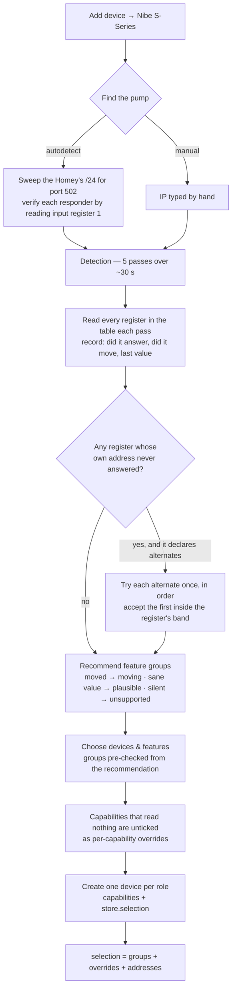

# Pairing, detection and register resolution

**Source of truth for what happens between "Add device" and a working device.** Update before a release that
changes detection, the pairing views or how a selection is stored.

Last verified against the code: **0.9.12**.

## The flow

Detection is skippable. Skipping it means no recommendation and no resolution, which the selection machinery
reads as **everything enabled on its primary address** — the same state a device paired before any of this
existed is in.

## What detection decides

Three separate outputs, often confused:

| Output | Question it answers | Consumed by |
|---|---|---|
| `recommendations` | is this feature group worth showing? | which group checkboxes start ticked |
| `samples` | did this individual register carry data? | which capabilities inside a ticked group start ticked |
| `addresses` | where does this register actually live? | what the runtime puts on the wire |

The evidence grades are deliberately ordered: a register that **moved** during sampling is live beyond
argument; one that merely read a **plausible** value might be a coincidence; one that never answered is
**unsupported** on this model.

Plausibility is not "did it answer". Register 2727 answered 31 of 31 reads and was flat zero through a
3.3 kW run — answering proves the address exists, not that the value means anything.

## Register resolution

A register may declare `altAddresses` plus an `altPlausible` band. Detection tries them **only when the
register's own address produced nothing at all across the whole run**, and records the first alternate that
reads inside the band.

Two different situations need this, and only one is predictable from Nibe's register maps:

| | what happens on the wire | example |
|---|---|---|
| **(a) relocation** | the primary doesn't answer; the register lives elsewhere on that model | heating medium pump speed at **1636** instead of 1102 on the S330/S332 |
| **(b) present but dead** | the primary answers, always with the not-available sentinel | room temperature on the **S735**: 111 is documented and empty, 26 is undocumented and correct |

**Case (b) is why a model-code lookup table cannot replace this.** Only reading the pump finds it. It is also
why model identification stays *reporting* — the type code and firmware are shown in Main's settings and in
the logs — rather than branching.

Currently declared:

| register | primary | alternate | on |
|---|---|---|---|
| room temperature (BT50) | 111 | 26 | S735 |
| heating medium pump speed (GP1) | 1102 | 1636 | S330/S332 |
| night cooling 1 | 227 | 2955 | S2125, S330/S332 |
| pulse energy meter (BE6) | 398 | 396 | S320/S325 |

### Choosing a band

The band's job is to reject an undocumented address that answers with something which merely *decodes* as a
number. Pick bounds that make a dead reading implausible:

- room temperature uses **5..40**, not −10..50, so a disconnected sensor's flat 0 falls outside;
- a pulse meter uses **0..1 000 000**, because a meter that has counted nothing genuinely reads 0.

There is no universal "reject exactly 0" rule, because whether 0 is data depends entirely on the register.

### Where the answer is kept

In the device's stored `selection`, as `addresses`, alongside the group and per-capability choices. It is
**not** a user choice and never round-trips through the pairing view — the driver stamps it in server-side,
and the picker carries it through untouched when it rebuilds the selection from the checkboxes.

At runtime it is applied in exactly two places:

- **reads** — `registersForRole()` hands out registers already rewritten onto their resolved address, so
  polling, the register dump and the flow autocompletes all follow without knowing anything moved;
- **writes** — resolved at the moment of the write, not baked into the capability listener. Listeners are
  created once at init, but a repair can re-run detection and move a register; reading the selection at write
  time picks that up without a restart.

The register dump marks a resolved register as `[was <primary>]`, so a support log answers "which address is
it actually reading?" outright.

### Picking it up on an existing device

Run the device's **Repair** flow (device menu → Repair). It re-runs detection against the live connection and
rewrites the selection. A device that has never been repaired keeps reading the primary address, exactly as
before — resolution never happens behind the user's back on a running device.

## Credits

The fallback mechanism, and the S735 evidence behind the room-temperature case, come from
[halderex](https://github.com/lovethyresson/com.nibe.local/pull/3). This implementation resolves at detection
rather than per-read, which also closes the gap where a *fresh* pair on an S735 would drop the capability
before any runtime fallback could apply.
